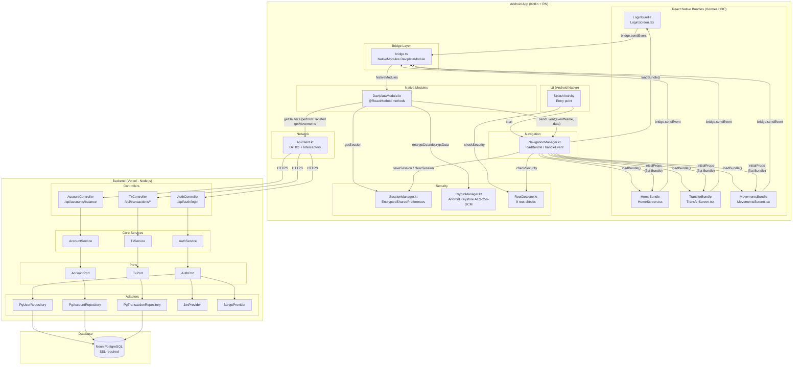

# Daviplata - Diagrama de Componentes

## Tabla de Componentes

| Componente | Archivo | Responsabilidad |
|------------|---------|-----------------|
| LoginBundle | `entry-points/login.js` | Formulario de autenticación |
| HomeBundle | `entry-points/home.js` | Dashboard con saldo y acciones |
| TransferBundle | `entry-points/transfer.js` | Formulario de transferencia |
| MovementsBundle | `entry-points/movements.js` | Historial paginado |
| bridge.ts | `src/services/bridge.ts` | Wrapper de NativeModules.DaviplataModule |
| DaviplataModule | `bridge/DaviplataModule.kt` | 8 métodos @ReactMethod |
| NavigationManager | `navigation/NavigationManager.kt` | Carga bundles y maneja eventos |
| SessionManager | `session/SessionManager.kt` | Sesiones cifradas |
| CryptoManager | `security/CryptoManager.kt` | AES-256-GCM Android Keystore |
| RootDetector | `security/RootDetector.kt` | Detección de dispositivos rooteados |
| ApiClient | `network/ApiClient.kt` | Cliente HTTP OkHttp |
| AuthController | `backend/adapters/in/AuthController.ts` | Login/logout endpoints |
| AuthService | `backend/core/services/AuthService.ts` | Lógica de autenticación |
| PgUserRepository | `backend/adapters/out/PgUserRepository.ts` | Persistencia PostgreSQL |
