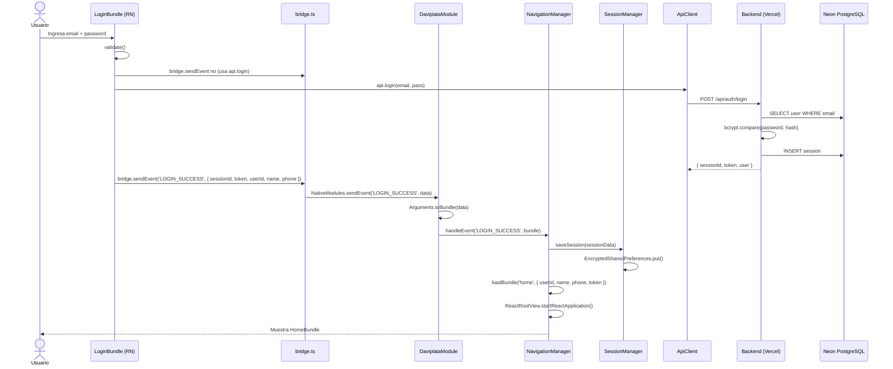
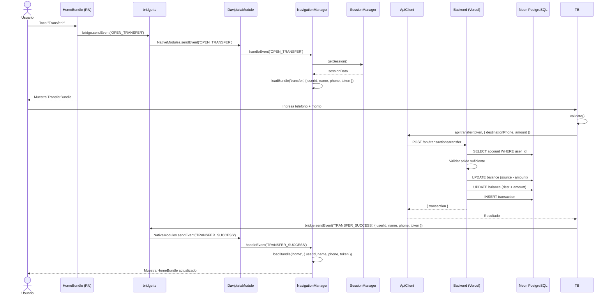
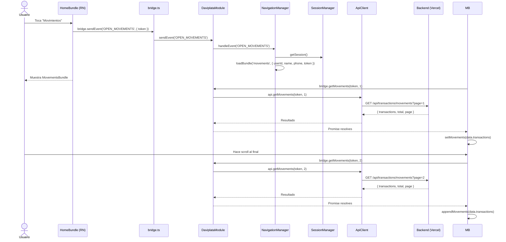
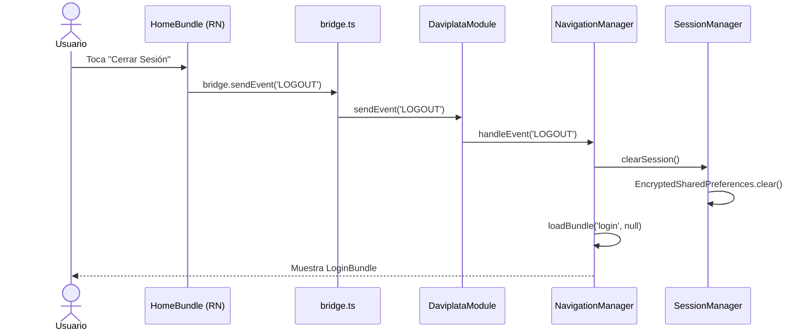
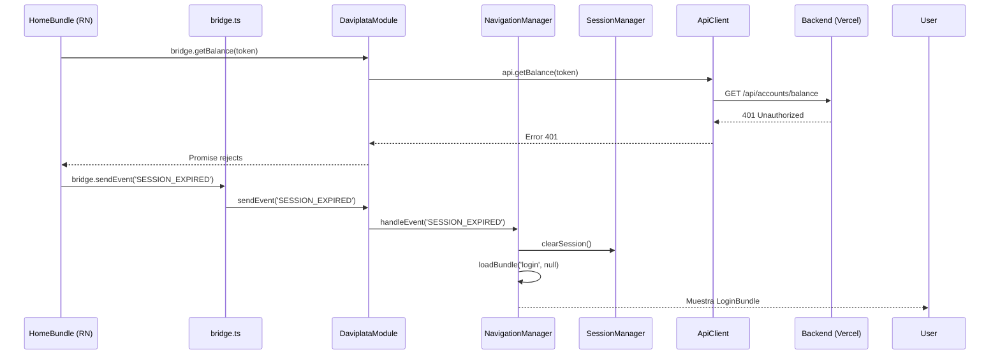

# Daviplata - Diagramas de Secuencia

## 1. Flujo de Login

```mermaid
sequenceDiagram
    actor User as Usuario
    participant LB as LoginBundle (RN)
    participant BR as bridge.ts
    participant DM as DaviplataModule
    participant NM as NavigationManager
    participant SM as SessionManager
    participant AC as ApiClient
    participant API as Backend (Vercel)
    participant DB as Neon PostgreSQL

    User->>LB: Ingresa email + password
    LB->>LB: validate()
    LB->>BR: bridge.sendEvent no (usa api.login)
    LB->>AC: api.login(email, pass)

    AC->>API: POST /api/auth/login
    API->>DB: SELECT user WHERE email
    API->>API: bcrypt.compare(password, hash)
    API->>DB: INSERT session
    API-->>AC: { sessionId, token, user }

    LB->>BR: bridge.sendEvent('LOGIN_SUCCESS', { sessionId, token, userId, name, phone })
    BR->>DM: NativeModules.sendEvent('LOGIN_SUCCESS', data)
    DM->>DM: Arguments.toBundle(data)
    DM->>NM: handleEvent('LOGIN_SUCCESS', bundle)
    NM->>SM: saveSession(sessionData)
    SM->>SM: EncryptedSharedPreferences.put()
    NM->>NM: loadBundle('home', { userId, name, phone, token })
    NM->>NM: ReactRootView.startReactApplication()
    NM-->>User: Muestra HomeBundle
```

## 2. Flujo de Transferencia

```mermaid
sequenceDiagram
    actor User as Usuario
    participant HB as HomeBundle (RN)
    participant BR as bridge.ts
    participant DM as DaviplataModule
    participant NM as NavigationManager
    participant SM as SessionManager
    participant AC as ApiClient
    participant API as Backend (Vercel)
    participant DB as Neon PostgreSQL

    User->>HB: Toca "Transferir"
    HB->>BR: bridge.sendEvent('OPEN_TRANSFER')
    BR->>DM: NativeModules.sendEvent('OPEN_TRANSFER')
    DM->>NM: handleEvent('OPEN_TRANSFER')
    NM->>SM: getSession()
    SM-->>NM: sessionData
    NM->>NM: loadBundle('transfer', { userId, name, phone, token })

    HB-->>User: Muestra TransferBundle

    User->>TB: Ingresa teléfono + monto
    TB->>TB: validate()
    TB->>AC: api.transfer(token, { destinationPhone, amount })
    AC->>API: POST /api/transactions/transfer
    API->>DB: SELECT account WHERE user_id
    API->>API: Validar saldo suficiente
    API->>DB: UPDATE balance (source - amount)
    API->>DB: UPDATE balance (dest + amount)
    API->>DB: INSERT transaction
    API-->>AC: { transaction }
    AC-->>TB: Resultado

    TB->>BR: bridge.sendEvent('TRANSFER_SUCCESS', { userId, name, phone, token })
    BR->>DM: NativeModules.sendEvent('TRANSFER_SUCCESS')
    DM->>NM: handleEvent('TRANSFER_SUCCESS')
    NM->>NM: loadBundle('home', { userId, name, phone, token })
    NM-->>User: Muestra HomeBundle actualizado
```

## 3. Flujo de Consulta de Movimientos

```mermaid
sequenceDiagram
    actor User as Usuario
    participant HB as HomeBundle (RN)
    participant BR as bridge.ts
    participant DM as DaviplataModule
    participant NM as NavigationManager
    participant SM as SessionManager
    participant AC as ApiClient
    participant API as Backend (Vercel)

    User->>HB: Toca "Movimientos"
    HB->>BR: bridge.sendEvent('OPEN_MOVEMENTS', { token })
    BR->>DM: sendEvent('OPEN_MOVEMENTS')
    DM->>NM: handleEvent('OPEN_MOVEMENTS')
    NM->>SM: getSession()
    NM->>NM: loadBundle('movements', { userId, name, phone, token })

    HB-->>User: Muestra MovementsBundle

    MB->>DM: bridge.getMovements(token, 1)
    DM->>AC: api.getMovements(token, 1)
    AC->>API: GET /api/transactions/movements?page=1
    API-->>AC: { transactions, total, page }
    AC-->>DM: Resultado
    DM-->>MB: Promise resolves
    MB->>MB: setMovements(data.transactions)

    User->>MB: Hace scroll al final
    MB->>DM: bridge.getMovements(token, 2)
    DM->>AC: api.getMovements(token, 2)
    AC->>API: GET /api/transactions/movements?page=2
    API-->>AC: { transactions, total, page }
    AC-->>DM: Resultado
    DM-->>MB: Promise resolves
    MB->>MB: appendMovements(data.transactions)
```

## 4. Flujo de LOGOUT

```mermaid
sequenceDiagram
    actor User as Usuario
    participant HB as HomeBundle (RN)
    participant BR as bridge.ts
    participant DM as DaviplataModule
    participant NM as NavigationManager
    participant SM as SessionManager

    User->>HB: Toca "Cerrar Sesión"
    HB->>BR: bridge.sendEvent('LOGOUT')
    BR->>DM: sendEvent('LOGOUT')
    DM->>NM: handleEvent('LOGOUT')
    NM->>SM: clearSession()
    SM->>SM: EncryptedSharedPreferences.clear()
    NM->>NM: loadBundle('login', null)
    NM-->>User: Muestra LoginBundle
```

## 5. Flujo de SESSION_EXPIRED

```mermaid
sequenceDiagram
    participant HM as HomeBundle (RN)
    participant BR as bridge.ts
    participant DM as DaviplataModule
    participant NM as NavigationManager
    participant SM as SessionManager
    participant AC as ApiClient
    participant API as Backend (Vercel)

    HM->>DM: bridge.getBalance(token)
    DM->>AC: api.getBalance(token)
    AC->>API: GET /api/accounts/balance
    API-->>AC: 401 Unauthorized
    AC-->>DM: Error 401
    DM-->>HM: Promise rejects

    HM->>BR: bridge.sendEvent('SESSION_EXPIRED')
    BR->>DM: sendEvent('SESSION_EXPIRED')
    DM->>NM: handleEvent('SESSION_EXPIRED')
    NM->>SM: clearSession()
    NM->>NM: loadBundle('login', null)
    NM-->>User: Muestra LoginBundle
```
