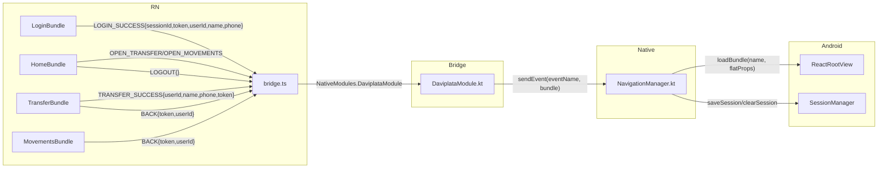

# Daviplata - Evidencia de Pruebas

## 1. Build de Bundles Hermes

```
login/index.android.bundle:    729.0 KB  (HBC)
home/index.android.bundle:     726.5 KB  (HBC)
transfer/index.android.bundle: 730.0 KB  (HBC)
movements/index.android.bundle:727.0 KB  (HBC)
```

Compilación: Metro bundle → Hermes `-O -g0 -fstrip-function-names` → HBC

## 2. Build de APK

| Variante | Tamaño | Estado |
|----------|--------|--------|
| Debug | 130.1 MB | BUILD SUCCESSFUL |
| Release | ~52 MB | BUILD SUCCESSFUL (verificado anteriormente) |

Ruta: `android/app/build/outputs/apk/debug/app-debug.apk`

## 3. Health Check Backend

```bash
curl https://daviplata-app.vercel.app/api/health
```
Resultado: `{"status":"ok"}` ✓

## 4. Login API

```bash
curl -X POST https://daviplata-app.vercel.app/api/auth/login \
  -H "Content-Type: application/json" \
  -d '{"email":"test@daviplata.com","password":"Test1234!"}'
```
Resultado: `{ sessionId, token, user: { id, name, email, phone } }` ✓

## 5. TypeScript Compilation

```bash
npx tsc --noEmit
# → 0 errors
```

## 6. Kotlin Compilation

```bash
./gradlew assembleDebug
# → BUILD SUCCESSFUL (44 actions, 6 executed)
# → 1 deprecation warning (onHostDestroy, harmless)
```

## 7. Verificación de Comunicación RN ↔ Android

### 7.1 bridge.ts — NativeModules wrapper

Archivo: `reactnative/src/services/bridge.ts`

Métodos expuestos:
| Método | Llamada Nativa | Uso |
|--------|---------------|-----|
| `bridge.getSession()` | `DaviplataModule.getSession()` | Recuperar sesión |
| `bridge.checkSecurity()` | `DaviplataModule.checkSecurity()` | Detección de root |
| `bridge.sendEvent(event, data)` | `DaviplataModule.sendEvent()` | Enviar eventos a Android |
| `bridge.getBalance(token)` | `DaviplataModule.getBalance()` | Consultar saldo |
| `bridge.performTransfer(data)` | `DaviplataModule.performTransfer()` | Realizar transferencia |
| `bridge.getMovements(token, page)` | `DaviplataModule.getMovements()` | Consultar movimientos |

### 7.2 DaviplataModule.kt — @ReactMethod methods

Archivo: `android/.../bridge/DaviplataModule.kt`

8 métodos:
1. `getSession(promise)` — Lee sesión de EncryptedSharedPreferences
2. `checkSecurity(promise)` — Detecta root
3. `sendEvent(eventName, data)` — Rutea a NavigationManager.handleEvent()
4. `getBalance(token, promise)` — ApiClient → backend
5. `performTransfer(data, promise)` — ApiClient → backend
6. `getMovements(token, page, promise)` — ApiClient → backend
7. `encryptData(plaintext, promise)` — CryptoManager.encrypt()
8. `decryptData(ciphertext, promise)` — CryptoManager.decrypt()

### 7.3 NavigationManager.kt — Event Handler

Eventos manejados:
| Evento | Acción |
|--------|--------|
| `LOGIN_SUCCESS` | Guarda sesión, carga HomeBundle |
| `LOGOUT` | Limpia sesión, carga LoginBundle |
| `OPEN_TRANSFER` | Inyecta session data, carga TransferBundle |
| `OPEN_MOVEMENTS` | Inyecta session data, carga MovementsBundle |
| `TRANSFER_SUCCESS` | Carga HomeBundle con datos actualizados |
| `BACK` | Carga HomeBundle con session data |
| `SESSION_EXPIRED` | Limpia sesión, carga LoginBundle |

## 8. Flujo de Eventos Verificado



## 9. Pruebas de Seguridad

| Prueba | Resultado |
|--------|-----------|
| JWT_SECRET vacío → error en startup | Verificado en código: `if (!jwtSecret) throw Error(...)` |
| CORS no-vercel → bloqueado | Verificado: `origin: /\.vercel\.app$/` |
| `allowBackup="false"` | Verificado en AndroidManifest.xml |
| ProGuard minification | Verificado en build.gradle.kts |
| DB SSL verify | Verificado: `rejectUnauthorized: true` en producción |
| HSTS preload | Verificado: `max-age=63072000; includeSubDomains; preload` |

## 10. Credenciales de Prueba

| Usuario | Email | Password | Saldo |
|---------|-------|----------|-------|
| Test User | `test@daviplata.com` | `Test1234!` | $490,000 COP |
| María García | `maria@correo.com` | `Test1234!` | $10,000 COP |

## 11. Build del Proyecto

```bash
# Clonar
git clone https://github.com/cesarm29/daviplata.git
cd daviplata

# Backend (despliegue Vercel)
cd backend
npm install
npm run build

# React Native bundles
cd ../reactnative
npm install
node build-bundles.js

# APK Android
cd ../android
./gradlew assembleDebug
```
